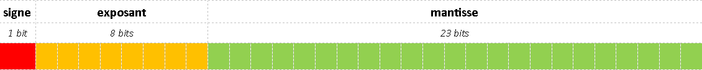
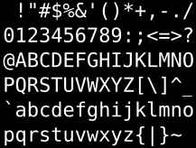

% Validité du logiciel numérique
% Division de enseignements en informatique
% 2016

# Fiche pédagogique #

## Objectifs ##

* Etre sensibilisé aux problèmes de précision, de capacité et de puissance de calculs des ordinateurs.

## Pré-requis ##

* Concepts élémentaires en algorithmie
* Notions de base en architecture informatique

## Auteurs ##

* © IGN 2016 - Clément Delgrange - ValiLab (DRE)

\newpage

# Introduction #

L'algorithmie ou l'analyse informatique s'attachent à décrire des solutions informatiques théoriques à un problème posé. Ces solutions décrivent un cheminement pour aboutir au résultat excompté et ne souffrent d'aucune ambiguité : en toutes circonstances l'algorithme fournit un résultat.

La mise en oeuvre pratique de ces solutions n'est pas aussi évidente et se trouve confronté à plusieurs limitations : une solution théorique apportant une réponse à un problème peut apporter un résultat imprécis une fois transposée sur un ordinateur ou résoudre le problème mais dans des échelles de temps non acceptables. C'est ce que nous nous proposons d'étudier dans ce cours.

Typiquement, l'implémentation d'une solution sur un ordinateur peut être confrontée à trois types de problèmes :

* des problèmes de **précision** : 0,1+0,1+0,1-0,3 n'est pas strictement égal à 0 en arithmétique d'un ordinateur;
* des problèmes de **capacité** : charger dans la mémoire vive d'un ordinateur une matrice carré de 100000 lignes, avec des entiers stockés sur 8 bits, demande environ 10 Go de RAM;
* des problèmes de **puissance** : pour un ordinateur grand marché effectuant $10^6$ opérations par secondes, un tri naif d'un tableau de 1000000 d'éléments prend plus d'une semaine.

Si les problèmes de capacité sont pratiquement résolus avec les évolutions récentes des ordinateurs, hormis pour quelques applications très poussées (il est tout de même assez rare de manipuler des matrices de 100000 lignes!), les problèmes de précision et de puissance sont encore au coeurs des problématiques actuelles.

Nous commencerons ce cours en revenant sur la représentration des nombres en machine pour montrer quelle imprécisions sur les calculs elle peut engendrer. Puis nous nous intéresserons à la complèxité des algorithmes qui nous permettra de comprendre pourquoi des algorithmes seront plus performants que d'autres en terme de temps de calcul.

\newpage

# Validité des calculs dans un ordinateur #

Si les informations traîtées par un ordinateurs peuvent être de différentes 
nature (nombre, texte, etc.), elles sont représentées et manipulées par 
l'ordinateur sous forme binaire (suite de 0 et de 1). Le **bit** 
(*binary digit*) est l'unité de base de la représentation binaire. Chaque 0 ou 
1 est un bit. "1001" est par exemple composé de 4 bits.

Cette représentation sous forme binaire a des conséquences sur les résultats de 
certaines opérations. L'opération "0,1 + 0,1 + 0,1 - 0,3" ne retourne par
exemple pas exactement 0 en arithmétique d'ordinateur.

Dans ce chapitre, nous nous attarderons sur la représentation des nombres en
machine (et les opérations associées), pour montrer comment elle peut induire 
des imprécisions sur les résultats de certains calculs.

## Les différentes bases - Notations utilisées ##
Dans la vie courante, nous utilisons des chiffres de 0 à 9 : il s'agit de la 
base 10, composée de 10 symboles (les 10 chiffres). Nous parlerons aussi de 
base naturelle. Pour représenter un nombre en base 10, nous l'écrirons 
simplement, comme nous avons l'habitude de le faire (par exemple : 2016).

Il est pourtant possible d'utiliser n'importe quelle autre base que la base 10.

* les égyptiens utilisaient une base 12 (duodecimal) pour compter les heures 
  et les mois
* les mayas et azteques ont employé une base 20 (vigésimal). Au moyen âge en 
  france on a également employé cette base (d'où le quatre-vingt).
* la base 60 (sexagésimal) était utilisée par les sumériens. Il sert toujours 
  pour mesurer les heures, minutes, secondes.

Pour écrire un nombre dans une autre base que la base naturelle, nous l'écrirons 
entre parenthèses et indiquerons la base en indice.

Par exemple $(146)_{8}$ représente le nombre *146* dans la base 8.

Dans le domaine de l'infomatique, la base naturelle est la base 2, ou 
représentation *binaire*. 
Les bases 8 et 16 (respectivement 8 et 16 symboles) sont également souvent 
utilisées en informatique. En effet, ces bases sont des puissances de 2 et 
chaque symbole correspond exactement à un groupe de bits (respectivement 3 et 4 
bits) ce qui rend les conversions très simples tout en apportant une écriture 
plus compacte que le binaire. 

En hexadécimal (base 16), comme notre écriture ne comporte que 10 chiffres, nous 
utilisons des lettres pour compléter : 0 1 2 3 4 5 6 7 8 9 A B C D E F. 
"A" vaut 10, "B" 11, etc.

| **Hexadécimal** | **Valeur** | **Binaire** |
|:---------------:|:----------:|:-----------:|
|  0	|  0   | 0000 |
|  1	|  1   | 0001 |  
|  2	|  2   | 0010 |  
|  3	|  3   | 0011 |  
|  4	|  4   | 0100 |  
|  5	|  5   | 0101 |  
|  6	|  6   | 0110 |  
|  7	|  7   | 0111 |  
|  8	|  8   | 1000 | 
|  8	|  9   | 1001 |  
|  9	|  10  | 1010 |  
|  A	|  11  | 1011 | 
|  B	|  12  | 1100 | 
|  C	|  13  | 1101 | 
|  D	|  14  | 1110 | 
|  E	|  15  | 1111 | 

En octal (base 8), chaque symbole correspond à un groupe de 3 bits. L'écriture 
est moins compacte que l'héxadécimal mais présente l'avantage de ne pas requérir 
de symbole supplémentaire.
 
| **Octal** | **Valeur** | **Binaire** |
|:---------:|:----------:|:-----------:|
|  0	|  0   | 000 |
|  1	|  1   | 001 |  
|  2	|  2   | 010 |  
|  3	|  3   | 011 |  
|  4	|  4   | 100 |  
|  5	|  5   | 101 |  
|  6	|  6   | 110 |  
|  7	|  7   | 111 |  

## Décomposition dans une base et calcul de la valeur en base naturelle ##
Pour comprendre comment s'effectue la décomposition d'un nombre exprimé dans 
une base donnée, nous partirons d'un exemple d'un nombre en base naturelle (base 
10).

Nous pouvons tous facilement établir que : 

$2016 = 2*1000 + 0*100 + 1*10 + 6*1$

Si nous utilisont des puissances de 10, cela donne alors : 

$2016 =  2*10^3 + 0*10^2 + 1*10^1 + 6*10^0$

Qui est la décomposition en base 10 de 2016.

La décomposition dans une autre base respecte le même schéma. La décomposition 
de $(146)_{8}$ s'écrira ainsi :

$(146)_{8} = 1*8^2 + 4*8^1 + 6*8^0$

Pour évaluer la valeur de ce nombre en base naturelle, il ne reste qu'à évaluer 
les différents termes de la décomposition :

$(146)_{8} = 1*64 + 4*8 + 6*1 = 102$

$(146)_{8}$ est égal à 102 en base naturelle.

La décomposition des nombres décimaux n'apporte pas de changement majeurs. Pour 
comprendre comment cela fonctionne, revenons à un exemple en base 10 :

$2016,125 = 2*1000 + 1*10 + 6*1 + 1*0,1 + 2*0,01 + 5*0,001$

Soit en utilisant des puissances de 10 :

$2016,125 = 2*10^3 + 1*10^1 + 6*10^0 + 1*10^{-1} + 2*10^{-2} + 5*10^{-3}$

Dans une autre base que la base naturelle, cela donnera par exemple :

$(1010,101)_2 = 1*2^3 + 0*2^2 + 1*2^1 + 0*2^0 + 1*2^{-1} + 0*2^{-2} + 1*2^{-3}$

Ce qui nous permet d'évaluer la nombre : $(1010,101)_2 = 10,625$

Pour finir ce paragraphe, nous remarquerons que le principe reste le même en 
hexadécimal, même si nous devons utiliser de nouveaux symboles :

$(2A3F)_{16} = 2*16^3 + A*16^2 + 3*16^1 + F*16^0$

Soit en remplaçant les lettres par leur valeurs en base 10 :

$(2A3F)_{16} = 2*16^3 + 10*16^2 + 3*16^1 + 15*16^0 = 10815$

## Passage de la base naturelle à une base quelconque ##
Pouvoir utiliser toutes ces bases sera d'autant plus intéressant si nous 
disposons de moyens pour passer d'une représentation dans une base à une 
représentation dans une autre base. Dans le paragraphe précédent, nous avons 
montré comment décomposer un nombre écrit dans une base quelconque, ce qui 
permettait ensuite de l'évaluer. Ce faisant, nous avons réalisé le passage d'une 
base quelconque à la base 10.

Il nous reste à effectuer l'opération inverse. Pour ce faire, nous allons 
utiliser une propriété mathématique illustrée par l'égalité suivante :

$2*16^3 + 10*16^2 + 3*16^1 + 15*16^0 = ((2*16 + 10)*16 + 3)*16 + 15$

Le principe de cette égalité va nous permettre de retrouver, par divisions 
entières successives, l'écriture dans une base quelconque.

> **Division entière** : soient a et b deux entiers positifs ($b > 0$). Il exite 
un unique couple d'entiers positifs (q, r) tels que 
$a = b*q+r$ avec $0 \leq r < b$. q est le *quotient* de la division entière 
de a par b et r est le *reste* de cette division entière.

Pour écrire 10815 en base 16, nous commencerons donc par effectuer la division 
entière de 10815 par 16 :

$10815 = 675 * 16 + 15$

Puis nous repartons du quotient sur lequel nous effectuons à nouveau une 
divison entière :

$675 = 42 * 16 + 3$

Et nous répétons l'opération jusqu'à ce que le quotient de la division entière 
soit nul :

$42 = 2 * 16 + 10$

$2 = 0 * 16 + 2$

Pour reconstituer la représentation en base 16, il ne nous reste plus qu'à 
assembler les restes des divisions entières en partant du dernier vers le 
premier :

$10815 = (2$ "10" $3$ "15"$)_{16} = (2A3F)_{16}$

Le principe est le même pour convertir vers une n'importe quelle autre base. 
Par exemple, pour retrouver l'écriture en base de 2 de 52 : 

$52 = 26 * 2 + 0$

$26 = 13 * 2 + 0$

$13 = 6 * 2 + 1$

$6 = 3 * 2 + 0$

$3 = 1 * 2 + 1$

$1 = 0 * 2 + 1$

Soit au final : 

$52 = (110100)_2$

Dans le cas de nombres à virgules, nous distinguerons les parties entières et 
décimales et traiterons chacune d'elles de manière séparée. Nous savons déjà 
traiter la partie entière et il nous reste à trouver une méthode pour la partie 
décimale. Pour comprendre comment opérer, repartons de la décomposition en base 
10 de 0,125 :

$0,125 = 1 * 10^{-1} + 2 * 10^{-2} + 5 * 10^{-3}$

Comme pour la partie entière, nous pouvons factoriser les $10^{-1}$ pour 
obtenir :

$0,125 = 10^{-1} * ( 1 + 10^{-1} * ( 2 + 10^{-1} * 5))$

Pour éviter d'avoir à manipuler des puissance négatives, prenons le problème 
dans l'autre sens :

$0,125 * 10 = 1 + 0,25$

$0,25 * 10 = 2 + 0,5$

$0,5 * 10 = 5 + 0,0$

A chaque étape, nous séparons ainsi les partie entières et décimale puis 
multiplions par la partie décimale par la base. La décomposition finale est 
égale à la suite des parties entières.

Tentons par exemple de convertir $10,25$ en base 2. Pour la partie entière, 
nous pouvons établir que :

$10 = (1010)_2$

Puis, pour la partie décimale :

$0,25 * 2 = 0 + 0,5$

$0,5 * 2 = 1 + 0,0$

Ce qui donne donc pour la partie décimale :

$0,25 = (0,010)_2$

Soit au final en réassemblant les deux parties :

$10,25 = (1010,010)_2$

## Un premier problème de précision ##
Revennons ici à notre problématique de départ : les erreurs lors de certaines 
opérations en mahcines. Pour ce faire, nous essayerons simplement de 
représenter 0,1 en base 2.

$0,1 * 2 = 0,2$

$0,2 * 2 = 0,4$

$0,4 * 2 = 0,8$

$0,8 * 2 = 1,6$

$0,6 * 2 = 1,2$

$0,2 * 2 = 0,4$

$0,4 * 2 = 0,8$

$0,8 * 2 = 1,6$

$0,6 * 2 = 1,2$

...

Nous pourrions poursuivre ainsi indéfiniement! Au même titre qu'il n'existe pas 
de représentation exacte de $1/3$ en base naturelle 
($1 / 3 \simeq (0,333)_{10}$), il n'existe pas de réprésentation exacte de 0,1 
en base 2 : $(0,2)_{10} \simeq (0,00110011)_2$.

## Arithmétique dans les bases différentes de la base naturelle ##

montrer juste ici quelques exemples d'additions et soustraction en base 2, 8 et 16 par exemple

## Représentation des nombres en machine ##
Dans les paragraphes précédents nous avons vu comment passer d'une base à une 
autre et comment effectuer des opérations dans ces différentes bases. Nous 
avons également montré comment traiter le cas des nombres décimaux. Si nous 
n'avons pas porté une attention particulière aux nombres négatifs, c'est que 
ceux-ci ne présentent pas de difficultés particulières : il suffit d'ajouter le 
signe "-" devant le nombre à représenter.

Dans cette partie, nous nous concentrons sur la représentation des nombres dans 
un ordinateur. La base utilisée sera donc la base 2. Quelques spécificités 
propres à l'architecture des ordinateurs viendront s'ajouter à cette 
représentation en binaire. Nous mettrons en évidence les problèmes résultants. 

\small 

Remarque : convention

Dans cette partie, nous ne manipulerons que les bases 2 et 10 qui ne 
seront plus nécessairement indiquées en indice des nombres.

\normalsize

### Cas des nombres négatifs ###
Un premier problème se pose pour la réprésentation des nombres négatifs en 
machine. En effet, un ordinateur ne parle que le binaire (0 et 1). Il devient 
donc inenvisageable d'utiliser un signe "-" qui n'est pas compris par 
l'ordinateur.

La solution la plus simple consiste à utiliser un nombre fixe de bits 
(généralement 8, 16, 32 ou 64 bits) et à réserver celui le plus à gauche (le 
*bit de poids fort*) pour le signe : 0 pour positif, 1 pour négatif. 

En appliquant cette règle et en utilisant un stockage sur 8 bits :

* $2 = 00000010$
* $(-2) = 10000010$

Cette représentation possède deux inconvénients majeurs :

* le nombre 0 possède deux représentations : 00000000 et 10000000;
* l'addition "classique" ne fonctionne plus si un des nombres est négatif :
	* $(-3) = 10000011$
	* $2 = 00000010$
	* Donc $(-3) + 2 = 10000011 + 00000010 = 10000101$, soit $-5$.

Afin d'améliorer la représentation, nous utiliserons alors une notation en 
**complément à deux**. Elle est obtenue de la manière suivante :

* les nombres positifs sont écrits normalement;
* pour les nombres négatifs :
	* inversion des bits de l'écriture binaire;
	* ajout de 1 au résultat.
 
Par exemple, pour représenter $-3$ :

* $3 = (00000011)_2$
* inversion des bits : 11111100
* ajout de 1 : 11111101
* soit $(-3) = 11111101$

L'opération $(-3) + 2$ est maintenant traduite en : 

$11111101 + 00000010 = 11111111$

qui si l'on revient à une représentation en base naturelle donne :

* un nombre négatif (commence par un "1"), on enlève 1 : 11111110
* invertion des bits : 00000001
* soit finalement -1.

Le résultat de l'addition en utilisant la représentation en complément à deux 
est exact.

\small

Remarque : nombres minimum et maximum représentables

En utilisant le représentation en complément à deux et un stockage sur e bits, 
(e-1) bits restent disponible pour indiquer la valeur du nombre. Celle-ci peut 
donc être comprise entre $-2^{e-1}$ et $2^{e-1} - 1$.

Par exemple :

* sur 8 bits : entre -128 et 127;
* sur 16 bits : entre -256 et 255.

\normalsize

### Cas des nombres décimaux ###
De même que pour les nombres négatifs, il n'est pas envisageable d'utiliser de 
virgule, non interprétable par un ordinateur parlant le binaire, pour 
représenter les nombres décimaux. 

Nous avons par ailleurs vu que pour représenter les nombres négatifs en machine, 
nous utilisons un nombre de bits fixe en réservant le bits de poids 
fort pour le signe.

En s'inspirant de ce qui est fait pour les nombres négatifs, une première 
approche pour représenter les nombres décimaux serait d'utiliser un nombre fixe 
de bits en en réservant certains bits pour la partie entière et d'autres pour 
la partie décimale. Si cette représentation est opérationnelle, en pratique, 
nous constatons que les nombres manuipulés possèdent généralement :

* soit beaucoup de chiffres avant la virgule et peu après 
  (ex : coordonnée d'un point d'intérêt en Lambert 93);
* soit beaucoup de décimales mais peu de chiffres avant le virgules 
  (ex : longitudes/latitude en radian).

Sans remettre en cause le fonctionnement de notre représentation, cela présente 
tout de même quelques inconvénients. Les nombres utiliseront soit beaucoup de 
bits pour la partie entière et peu pour la partie décimale, soit l'inverse. Il 
devient dès lors difficile de réserver un nombre de bits adéquats pour chacune 
des parties et nous utiliserons beaucoup d'espace pour stocker des 0.

Pour palier aux limites de cette première approche, nous utiliserons une 
**représentation en virgule flottante** qui consiste à utiliser une forme 
normalisée de la représentation binaire kdu type $x = \pm a * 2^n$ où :

* $a$ est la *mantisse* comprise entre 1 et 2;
* $n$ est un entier relatif appelé *exposant*.

Par exemple :

$9,5 = (1001,1)_2 = (1,0011)_2*2^3$

Le stockage de ce nombre dans l'ordinateur s'effectuera alors sous la forme 
d'un triplet (signe, exposant, mantisse) avec :

* 1 bit pour le signe : 0 pour positif / 1 pour négatif;
* e bits pour l'exposant;
* m bits pour la mantisse.

La norme IEEE-754 définit plusieurs formats basés sur ce modèle, différant par 
la précision de chacun d'eux :

* la simple précision utilise 1 bit de signe, 8 d'exposant et 23 de mantisse
* la double précison utilise 1 bit de signe, 11 d'exposant et 52 de mantisse

Elle précise également quelques règles améliorant la précision des nombres 
représentables :

* en binaire, la partie entière de la mantisse vaut toujours 1. Seule la valeur 
  de la partie décimale sera donc stockée;
* pour éviter d'avoir à stocker des exposants négatifs, un *décalage* de 
  $+ (2^{e-1} - 1)$ est appliqué à la valeur des exposants (127, par exemple, en 
  simple précision).

Pour calculer la valeur correspondant à un triplet stocké en respectant la norme 
IEEE-754, nous appliquerons finalement la formule :

$valeur = (-1)^{s} * (m + 1) * 2^{e - decalage}$

où :

* s = 0 pour un nombre positif / 1 pour un nombre négatif
* m = nombre compris entre 0 et 1
* e = exposant décalé compris entre $-2^{e-1} + 1$ et $2^{e-1}$

 

Par exemple :

$9,5$ = 0  10000010  00110000000000000000000

$0,15625$ = 0  01111100  01000000000000000000000

$-2,25$ = 1  10000000  00100000000000000000000

Quelques exceptions à cette règle existent toutefois. En effet la représentation n'est pas correcte pour les nombres valant 0 ou proche de 0. Si l'exposant vaut 0, la règle est alors de ne pas ajouter 1 à la mantisse. De même, si l'exposant vaut $2^{e - 1}$, la norme indique que le nombre vaut l'infini.

Le tableau suivant résume les formes normalisées/non normalisées de la norme :

| **Exposant décalé** | **Mantisse** | **Type**  |
|:-------------------:|:------------:|:---------:|
| 0                   | 0            | 0         |
| 0                   | =! 0         | $(-1)^{s}.m.2^{1-d}$ |
| de 1 à $2^e - 2$    | quelconque   | $(-1)^{s}.(m+1).2^{1-d}$ |
| $2^e - 1$           | 0            | infini    |
| $2^e - 1$           | =! 0         | NaN       |

### Opérations sur les nombres en machine ###
La norme IEEE-754 consistant à représenter les nombres sous une forme du type 
$\pm a * 2^n$, l'addition de deux nombres ne sera possible que si leurs 
exposants sont identiques. L'opération consistera alors simplement à 
additionner les mantisses.

Une addition sera donc constituée de trois étapes :

* *alignement des mantisses* afin d'avoir deux exposants égaux
* addition des mantisses
* renormalisation si le résultat ne respecte plus la norme

Au cours de ces étapes, il faudra veiller à gérer correctement le 
*bit implicite* (partie entière de la mantisse non représentée dans la norme 
IEEE-754).

Illustrons avec un exemple, en tentant de calculer **9,5 + 1,75** :

$9,5$  = 0 10000010 00110000000000000000000

$1,75$ = 0 01111111 11000000000000000000000

L'exposant de 9,5 vaut 130 et celui de 1,75 vaut 127. Il faut donc décaler la 
mantisse de 1,75 (plus petit exposant) de 3 vers la droite, sans oublire  
d'insérer le bit implicite (entre parenthèse si dessous) :

\begin{tabular}{cccccc}
  & 0 & & 01111111 &(1)& 11000000000000000000000 \\
  &   & &          &   &  \\
  & 0 & & 10000010 &(0)& 00\textbf{1}11000000000000000000 \\
\end{tabular}

Il est maintenant possible d'additionner les mantisses :

\begin{tabular}{cccccc}
  & 0 & & 10000010 &(1)& 00110000000000000000000 \\
+ & 0 & & 10000010 &(0)& 00111000000000000000000 \\
\hline
= & 0 & & 10000010 &(1)& 01101000000000000000000 \\
\end{tabular}

La représentation est déjà normalisée (bit implicite valant 1). L'addition 
est terminée.

Pour contrôler le résultat, évaluons le en base naturelle :

0 10000010 01101000000000000000000

$= (-1)^0 * (1,01101)_2 * 2^{130-127}$
$= (1011,01)_2$
$ = 11,25$

Le résultat est correct !

Autres exemples intéressants (nécessite de bien gérer le bit implicite) :

* 9,5 + 9,25
* 9,875 - 1,75
* 9,75 - 9,5

### Limites de la représentation ### 
L'alignement des mantisses peut faire disparaître des bits "utiles" (ie. 
différents de 0) de la représentation.

Par exemple :
* $9,5 + 1,7500001$
	* le 0,0000001 est perdu : cela revient à additionner 9,5 + 1,75
* $10^{16} + 0,1$
	* le 0,1 est perdu : cela revient à additionner 0
* $9,500000953674316 - 9,5$
* $(1000000 + 0,01171875) - 1000000$

**0,1 + 0,1 + 0,1 - 0,3**.

Les réprésentation de 0,1 et 0,3 sont :

0,1 = 0 01111011 10011001100110011001101

0,3 = 0 01111101 00110011001100110011010

On calcule 0,1+0,1 :

\begin{tabular}{cccccc}
  & 0 & & 01111011 &( 1)& 10011001100110011001101 \\
+ & 0 & & 01111011 &( 1)& 10011001100110011001101 \\
\hline
= & 0 & & 10000010 &(11)& 00110011001100110011010 \\
\end{tabular}

On ajoute encore 0,1 :

\begin{tabular}{cccccc}
  & 0 & & 01111011 &( 11)& 00110011001100110011010 \\
+ & 0 & & 01111011 &(  1)& 10011001100110011001101 \\
\hline
= & 0 & & 10000010 &(100)& 11001100110011001100111 \\
\end{tabular}

Renormalisation de la mantisse de **0,1+0,1+0,1** :

\begin{tabular}{cccccc}
  & 0 & & 01111011 &(100)& 11001100110011001100111 \\
  &   & &          &     &    \\
  & 0 & & 01111101 &  (1)& 00110011001100110011001 \\
\end{tabular}

Et on retire 0,3, le principe pour les soustractions étant le même que pour les additions (alignement des mantisses, opération sur les mantisses, renormalisation, le tout sans oublier de gérer le bit implicite.

Soustraction des mantisses :

\begin{tabular}{cccccc}
  & 0 & & 01111011 &( 1)& 00110011001100110011001 \\
- & 0 & & 01111101 &( 1)& 00110011001100110011010 \\
\hline
= & 1 & & 01111101 &( 0)& 00000000000000000000001 \\
\end{tabular}

Il reste à renormaliser la mantisse :

\begin{tabular}{cccccc}
  & 1 & & 01111101 &(0)& 0000000000000000000000\textbf{1} \\
  &   & &          & & \\
  & 1 & & 01100110 &(\textbf{1})& 00000000000000000000000 \\
\end{tabular}

Soit en évaluant l'expression : $-2^{-25} = -3*10^{-8}$

## Représentation des caractères en machine ##

Une chaîne de caractères est représentée comme une suite de caractères. Le codage des caractères est fait grace à une table de correspondance indiquant l'équivalent binaire de chacun des caractères. La table de correspondance la plus utilisée est l'ASCII (Américan Standard code for Information Interchange). Chaque caractère y est représenté sur 7 bits. Notons que le code ASCII étendu, utilisant 8 bits, permet de coder des caractères supplémentaires (accents, etc.) non présent initialement dans la langue anglaise.

Le codage ASCII utilisant 7 bits, la table complète permet de représenter 128 caractères (2^7). Les caractères correspondant au codes 0 à 31 et 127 représentant des caractères de contrôles (retour à la ligne ou autres actions spécifiques), restent 95 caractères affichables.

Nous avons vu qu'il était courant, dans un ordinateur, de représenter les chiffres binaires sur un nombre fixe de bits (32 ou 64 bits pour la norme IEEE-754 par exemple). Ces représentations trouvent ainsi une forme condensée sur 4 ou 8 octets en hexadecimal, ce qui simplifie grandement l'écriture : 4 caractères en hexadécimal contre 32 en binaire...

Exemple : Extrait de la table ASCII

| **En base 10** | **En base 16** | **En base 2** | **Symbole ASCII** | **Détail** |
|:---:|:---:|:---------:|:---:|:-----|
| 63  | 3F  | 00111111  | ?   | Point d'interrogation |
| 64  | 40  | 01000000  | @   | Arobase8 |
| 65  | 41  | 01000001  | A   | Lettre latine capitale A |
| 66  | 42  | 01000010  | B   | Lettre latine capitale B |
| 67  | 43  | 01000011  | C   | Lettre latine capitale C |

# Complexité en algorithmie #

La théorie de la **complexité algorithmique** s'intéresse à l'estimation de l'efficacité des algorithmes. Elle s'attache à répondre à diverses questions sur un algorithme : 

* l'algorithme apporte-t-il une réponse au problème posé ? C'est la notion de **terminaison**
* l'algorithme apporte-t-il la bonne réponse au problème posé ? Notion de **validité**
* l'algorithme apporte-t-il la bonne réponse dans un temps acceptable ? Notion de **complexité**

Afin de définir précisément ces trois notions, commençons par redéfinir de manière plus mathématique un algorithme.

> Un algorithme est formé d'un ensemble fini d'opérations liées par une structure de contrôle et dont les opérandes portent sur un ensemble fini de variables.

Un algorithme résoud le problème qui est posé si la suite des opérations est finie (*condition de terminaison*) et si, lors de la terminaison, le sous-ensemble des variables de sortie contient le résultat du problème (*condition de validité*).

Prouver un algorithme c'est démontrer mathématiquement que les conditions de terminaison et de validité sont satisfaites.

S'intéresser à l'estimation du nombre d'opérations nécessaires, à une constante près, pour résoudre le problème sur un sous-ensemble de taille fixe n, c'est établir la classe de complexité de l'algorithme.

	
## Terminaison et validité ##
Nous illustrerons par quelques exemples la démonstration des preuves de terminaison et de validité d'un algorithme.

Considérons l'algorithme effectuant la somme des éléments d'un tableau.

.......

La terminaison est évidente puisque l'algorithme est constituée d'une boucle qui exécute n fois une somme et une affectation (opérations s'exécutant en temps fini).

Pour démontrer la validité, nous procédons par récurrence sur la taille du tableau. Nous devons démontrer que la formule $S(n) = \sum_{i}^{n} T_i$. 

* Si le tableau est composé de zero élément, la somme est initialisée à 0 avant la boucle et la boucle est parcourue 0-fois. La somme est donc correcte.
* Si le tableau est composé d'un élément, la somme calculée par l'algorithme est toujous correcte : elle est initialisée à 0 pour $T_1$ est ajouté ($S = 0 + T_1 = T_1$), ce qui est correct.
* Si l'algorithme est vrai pour un tableau de p éléments, nous devons démontrer qu'elle l'est pour un tableau de p+1 éléments. $S_{p+1} = S_p + T_{p+1} = \sum_{i}^{n} T_i$. La formule est donc correcte.

Exemple 2 : somme récursive des éléments d'un tableau

Exercice 1 : algorithme mystère 

* algo de calcul de 2^2^n
* calcul de la complexité de l'algorithme
* comment améliore cette complexité ?

Exercice 2 : polynômes (algo de calcul en x donné)

* dérouler l'algo pour x=2 et T=3, 8, 0, 1, 1, 2
* que calcul d'algorithme ? démontrer la terminaison et la validité de l'algorithme
* quelle est la complexité ?
* proposez le même algorithme en récursif
* quelle est la complexité du nouvel algorithme ?

## Complexité ##

### Petit historique ###
A l'origine des analyses de complexité algorithmique, on indiquait, pour chaque algorithme trouvé, le temps de calcul pour un nombre donnée d'éléments en entrée, sur un processeur et avec un langage donnés. Cette méthode souffrait d'une grande faiblaisse : il était quasiment impossibilité de comparer les algorithmes entre eux.

La nécessité de disposer d'une approche indépendante des facteurs matériels s'est alors fait sentir.

L'idée de compter le nombre d'opérations élémentaires d'un algorithme est alors apparue. 

La taille des données pouvant avoir un impact sur la performance d'un algorithme, elle peut également être prise en compte.

### Notion de complexité ###
4 opérations élémentaires :

* adition, soustraction, multiplication, division
* accès mémoire
* comparaisons
* calculs sur les pointeurs

3 modes de calcul de la complèxité d'un algorithme :

* pire des cas : notation O(f(n))
* meilleur des cas : notation sigma(f(n))
* cas moyen : notation 

Notations de Landau

* Borne asymptotique supérieure (existe k, n0 tels que pour `n > n0, 0 < f(n) < k.g(n)`)
* Borne asymptotique inférieure
* Borne asymptotique

Les complexités que l'on rencontre fréquement sont les suivantes :

* 1 : accès constant
* log(n) : logarithmique
* n : linéaire
* n.log(n) : quasi-linéaire
* n2 : quadratique
* n3 : cubique
* np : polynomiale
* 2n : exponentielle
* n! : factorielle

Tableau des temps d'exécution pour divers fonctions sur une données de taille 
n=10, 20, 30, 60, en considérant que l'ordinateur traite les insctructions en 
$10^{-6}$ secondes.

| n        |  10  |  20  |  30  |  60  |
|:---------|:----:|:----:|:----:|:----:|
| $log(n)$ |  $2,3.10^{-6}$  |  $3,0.10^{-6}$  |  $3,4.10^{-6}$  | $4,09.10^{-6}$  |
| $n$      |  $1.10^{-5}$  |  $2.10^{-5}$  |  $3.10^{-5}$  |  $6.10^{-5}$  |
|$n.log(n)$|  $2,3.10^{-5}$  |  $5,99.10^{-5}$  |  $1,02.10^{-4}$  |  $2,46.10^{-4}$  |
| $n^2$    |  $10^{-4}$  |  $4.10^{-4}$  |  $9.10^{-4}$  |  $3,6.10^{-3}$  |
| $n^3$    |  $10^{-3}$  |  $8.10^{-3}$  |  $2,7.10^{-2}$  |  $2,16.10^{-1}$  |
| $2^n$    |  $1,02.10^{-3}$  |  $1,05$  |  $1,07.10^3  |  $1,15.10^12$  |
| $n!$       |    |    |    |    |

Il est intéressant de remarquer que 10^12 secondes équivaut à environ 36 000 annnées !

## Application : comparaison de divers algorithmes de tri ##

* tri par sélection (trouver le plus petit et le mettre au début)
* tri par séléection récursif (trouver le plus grand, le mettre à la fin et recommancer sur le tableau 0:n-1)
* tri par insertion (tri des 2 premiers éléments, insertion du 3ème, etc.)
* tri fusion (découper en deux et trier chaque partie puis fusionner)
* tri bulle (comparer chaque élément à son suivant et recommencer)
* tri rapide (choisir un pivot, placer les plus petits avant, les plus grands 
après et trier chaque partie)

Illustration en codant les algorithmes sous Python (plateforme de test : Ubuntu 14.04 64bits / 7,7Gio RAM / Intel® Core™ i5-3337U CPU @ 1.80GHz × 4  / Python 3.4). Moyennes sur 10 exécutions de tri d'un tableau de 10000 entiers aléatoires entre 0 et 1000 :

* Tri par sélection: 3.2706
* Tri par sélection récursif: 3.1255
* Tri par insertion: 4.0774
* Tri fusion: 0.0434
* Tri bulle: 5.2502
* Tri rapide: 0.000005

