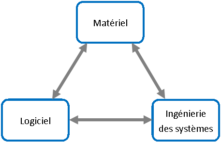
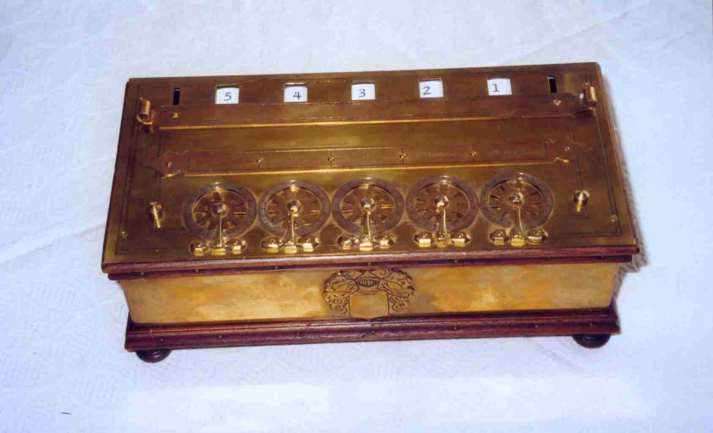
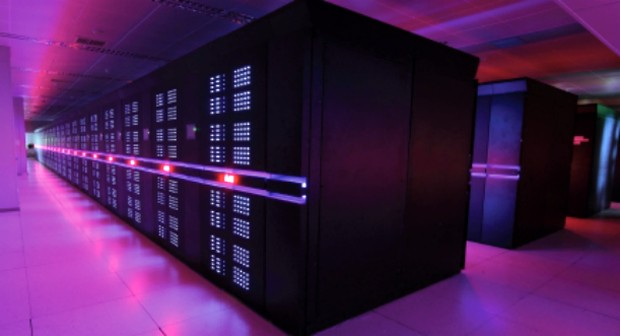
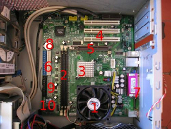
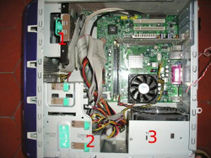
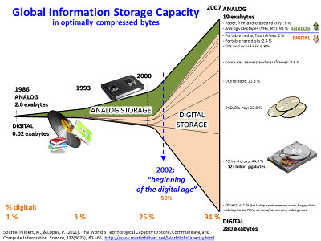
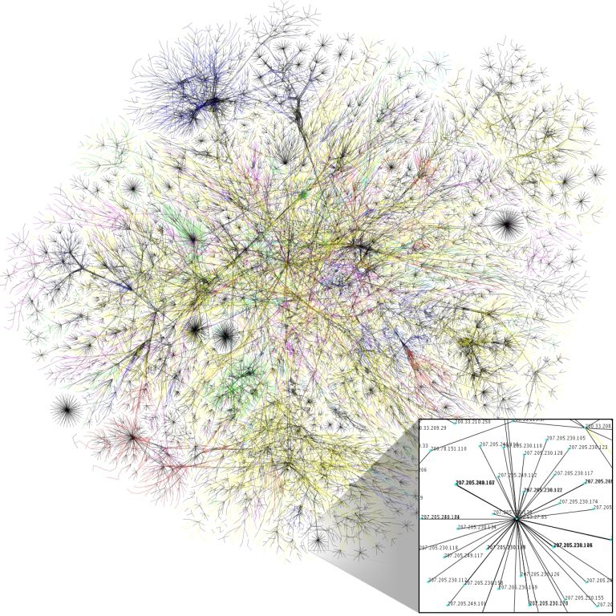
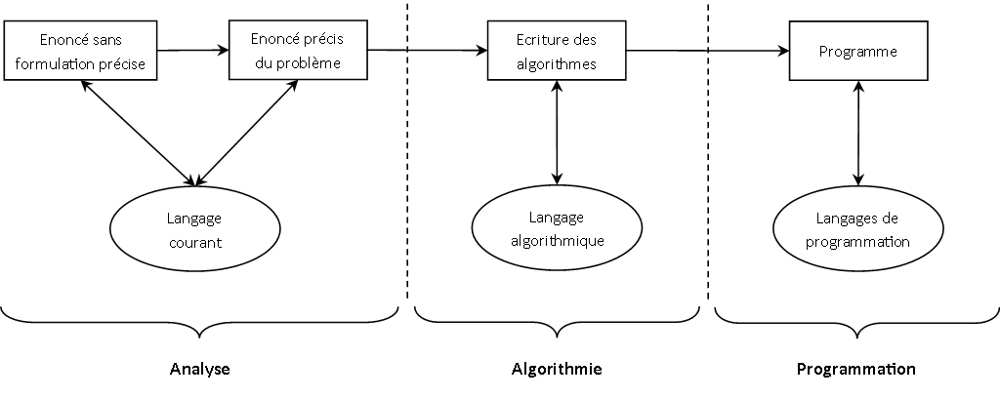
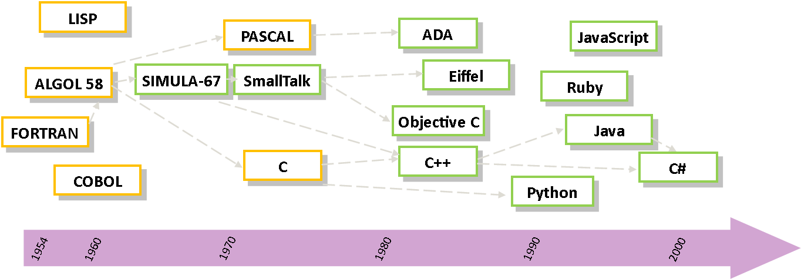

## Objectifs ##

* Connaître les composants de l'informatique (hardware, software et l'ingéniérie des systèmes d'information) ;
* Connaître le vocabulaire des "informaticiens".

## Pré-requis ##

Aucun

## Auteurs ##

* © IGN 2016 - Clément Delgrange, Benoît Costes, Didier Richard - ValiLab (DRE)
* Wikipedia®
* © IGN 2019 - Amaury Zarzelli (Pôle Technique Géoportail) (DSTI) (Légères modifications, adaptation à Markdown)

# Introduction #

Ce cours est une introduction générale à l'informatique. Nous étudierons trois volets de l'informatique :

* le matériel (*hardware* - 1945);
* les logiciels (*software* - 1950) : regroupe l'ensemble des méthodes, techniques et outils pour transformer les besions des utilisateurs en application informatique;
* ingénierie des systèmes d'information (*brainware* - 1974) : regroupe l'ensemble des méthodes, techniques et outils utilisés pour le développement des spécifications.

# Architecture matérielle #

## Historique ##
Les premières machines à calculer mécaniques ont été réalisées dans les années 1600. Elles permettaient d'exécuter des additions et soustraction, puis même des multiplications et divisions sans qu'un humain ait à intervenir pour résoudre le calcul.

Puis, les machines à calculer programmables font progressivement leur apparition à partir des années 1800. Elles utilisent des cartes perforées pour effectuer des calculs ou résoudre des équations de manière beaucoup plus rapide que les machines mécaniques. Ces machines à calculer évolueront en se dotant par exemple de clavier pour saisir les données.

Enfin, les premiers vrais ordinateurs apparaîtront au cours de la première moitié du 20ème siècle. Nous distinguerons quatre générations d'ordinateurs :

* 1945-1950 : à *tubes à vide* (ou lampes); capables de réaliser ~5000 opérations par seconde
* 1950-1955 : à *tores de ferrite*; ~40000 opérations par seconde
* 1956-1963 : à *transistors*; ~100000 opérations par seconde
* 1963-1971 : à *circuits intégrés*; ~1000000 opérations par seconde; période d'explosion de l'utilisation de l'informatique

La miniaturisation des composants (microprocesseurs, very large scale integration) prend le relai dans l'évolution des matériels, mais sans apporter de changements majeurs dans l'architecture des ordinateurs.

La loi de Moore (1965) stipule qu'à surface constante, le nombre de transistors que les industriels arriveront à intégrer dans un ordinateur doublera tous les deux ans. Cette augmentation est rendue possible par la diminution de la taille de gravage des transistor (~20nm de nos jours). En 2016, la loi de Moore semble avoir atteint ses limites et nous observons un ralentissement dans la croissance (les problèmes expliquant ce ralentissement sont : l'évacuation de la chaleur, la tension minimale atteinte, la fréquence maximale approchée).

La solution actuelle pour poursuivre l'amélioration des performances est de faire plus de processeur sur la même puce (bi-coeurs, quadri-coeurs...). Mais cela nécessite de revoir la manière de programmer pour utiliser efficacement ces différents coeurs.

## Information minimale dans un ordinateur ##

De nombreux moyens techniques permettent de coder une information. La polarisation magnétique, la charge électrique servent au stockage, le courant ou la tension électrique, l'intensité lumineuse sont couramment utilisés pour la transmission d'information. L'information passe ou ne passe pas (2 états). L'essentiel est de distinguer avec une très bonne fiabilité les deux états de manière à limiter les erreurs : un interrupteur peut être soit ouvert, soit fermé pour coder 0 ou 1 ; l'autre état code l'autre valeur. Il en va de même pour la tension ou le courant électrique, la polarisation magnétique, la lumière allumée ou éteinte.

La correspondance entre chacun des deux états et une valeur élémentaire d'information.

Le bit est l'unité la plus simple dans un système de numération, ne pouvant prendre que deux valeurs, désignées le plus souvent par les chiffres 0 et 1. Un bit ou élément binaire peut représenter aussi bien une alternative logique, exprimée par faux et vrai, qu'un chiffre du système binaire.

Le mot « bit » est la contraction des mots anglais binary digit, qui signifient « chiffre binaire », avec un jeu de mot sur bit, « petit morceau ».

Dans la théorie de l'information, un bit est la quantité minimale d'information transmise par un message, et constitue à ce titre l'unité de mesure de base de l'information en informatique.

Les systèmes numériques traitent exclusivement des informations réduites en bits, en général associés dans des groupes de taille fixe appelés *byte* ou *octet* (8 bits).

## Performance des systèmes informatiques ##
Pour mesurer la vitesse des ordinateurs, nous retiendrons deux indicateurs :

* le nombre d'opérations par seconde, mesurée généralement en millions d'instructions par seconde (**MIPS**);
* le nombre d'opérations en virgule flottante par seconde (**FLOPS**) qui inclut les opérations sur des nombres réels plus lentes que les opérations sur les entiers.

En 2016, un ordinateur personnel peut développer une puissance d'environ 200 GigaFLOPS avec un microprocesseur Intel Core i7-3770 (2 milliards de transistors dans le circuit intégré) et 5000 GigaFLOPS avec un processeur graphique  Nvidia GTX690.

En 2013, le supercalculateur le plus puissant, Tianhe-2, affiche une puissance de 33,86 PetaFLOPS (1015)... dépassé aujourd'hui (2016) par le réseau de minage
permettant la génération de la crypto-monnaie Bitcoin qui totalise une puissance d'environ 18 000 exaFLOPS (1018) !

Nous prendrons ici le temps de comparer les performances de deux ordinateurs de 1971 et 2010 pour constater que la puissance d'un ordinateur ne dépend pas que de sa fréquence :

* 1971 : processeur Intel 4004
	* 2300 transistors dans un unique circuit intégré
	* fréquence de 740 kHz
	* 0,092 MIPS
* 2011 : Intel Core i7 2600K
	* 1,4 milliards de transistors
	* fréquence de 3,4 GHz
	* 4 coeurs, 8 threads
	* 128300 MIPS

Entre le 4004 et le Core i7 2600K, la fréquence a été multipliée par 4600 et la puissance MIPS par 1,4 million.

## Architecture d'un ordinateur ##
Un ordinateur est un ensemble de circuits électroniques permettant de manipuler des données. Il est constitué de différents composants matériels (notion de **périphérique**) articulés autour d'une **carte mère**. Cette carte mère est classiquement décomposée en une *unité de traitement*, effectuant les opérations, et une *unité de contrôle*, chargée du séquencement des opérations.

* 1 : Processeur, « cerveau » de l'ordinateur, c'est lui qui lit, décode, et exécute les instructions envoyées par la RAM
* 2 : RAM. Mémoire vive de l'ordinateur la RAM permet à l'ordinateur de récupérer des informations inscrites dans ces barrettes plus rapidement que si elles étaient inscrite dans le disque dur. La mémoire enregistrée dans ces barrettes est effacée et modifiée très fréquemment et à chaque fois que l'on éteint l'ordinateur
* 3 : Chipset: Permet de gérer les flux de données entre la mémoire, les différents périphériques et le processeur
* 4 : Ports PCI (ou bus PCI): Permet d'ajouter des composants à l'ordinateur comme des cartes de son ou autre.
* 5 : Support de la carte graphique
* 6: Bus transmettant les informations stockées dans le disque dur ou le DVD quand ceux-ci sont branchés
* 7 : Bus externes (USB, imprimante, etc.)
* 8 : Pile : Petite batterie permettant à l'ordinateur d'effectuer des fonctions minimes lorsqu'il est hors-tension (horloge par exemple). Permet de garder en mémoire les réglages du BIOS.
* 9 : Prise d'alimentation de la carte mère (le fil jaune et noir correspond aussi à une alimentation): Permet d'alimenter la carte mère quand branché.
* 10 : Bios : Permet d'effectuer les fonctions basiques lors du démarrage de l'ordinateur.

Nous distinguons les périphériques inclus à l'unité centrale de l'ordinateur, qui sont dits **internes**, de ceux **externes**. Les composants internes sont par exemple : de la mémoire vive (RAM), un disque dur, une carte graphique, un lecteur DVD, des ports d'entrées/sorties. Ils sont reliés à la carte mère par des **bus informatiques**. Les composants externes peuvent être une imprimante, une clés USB, etc. et sont connectés à la carte mère via un ports d'entrées/sorties.

* 1 : Disque dur
* 2 : Lecteur CD / graveur
* 3 : Alimentation

La **mémoire**, qui contient les données et les programmes (listes des opérations que l'unité de contrôle doit exécuter), peut être de deux types différents :

* la mémoire centrale, aussi dite mémoire vive et noté RAM (*Random Access Memory*);
* et la mémoire morte, noté ROM (*Read Only Memory*).

La mémoire centrale est rapide d'accès mais volatile. Son contenu est perdu lorsque l'ordinateur cesse d'être alimenté en électricité. De ce fait, elle est destinée au transit des données en cours de traitement mais n'est pas adaptée à leur sauvegarde.

A l'inverse, la mémoire morte est plus lente d'accès, mais ne s'efface jamais et permet de conserver les données sur le long terme. Elle est réalisée sur des supports physiques (disque dur, CD, etc.).

L'**adresse mémoire** permet d'identifier de manière unique un emplacement dans la mémoire de l'ordinateur. Il faut ici voir la mémoire de l'ordinateur comme un meuble constitué d'innombrables casiers, chaque casier étant étiquetté avec un numéro permettant de le retrouver à coup sur.

### Stockage ###
Le stockage d'information est aujourd'hui assuré par un support d'information
électronique donc matériel. Ainsi, le terme de dématérialisation employé pour
désigner le passage d'un support d'information papier à un support
électronique est peu approprié, puisque ce dernier est lui aussi matériel.

Le choix de la méthode de stockage se fait selon plusieurs critères :

* la fréquence d'utilisation (de continu à rarement) ;
* les besoins capacitaires de l'information ; c'est la taille ;
* la criticité de l'information :
    * coût en cas de perte ;
    * sécurité (confidentialité).

L'évolution des techniques de stockage est rapide, et tend vers plus de
capacité, plus de vitesse, plus de fiabilité, tout en étant moins cher à
capacité équivalente. Les types de média sont variés et changent souvent.

Nous pouvons disposer aujourd'hui de différents médias de stockage d'information :

* cartes mémoire ;
* clefs USB ;
* cédéroms, dévédéroms ;
* disques ;
* bandes magnétiques.

#### Stockage de masse ####
L'objectif est de stocker une grande quantité d'information à long terme. Nous
pouvons distinguer plusieurs générations :

* Première génération :
  les supports physiques, avec la carte perforée et le
  ruban perforé. Ces supports sont obsolètes depuis la fin des années 1990 ;
* Deuxième génération :
  les supports magnétiques, comme la bande magnétique, sa petite soeur la
  cassette, le disque dur, la disquette. Les bandes magnétiques ne sont
  plus utilisées que pour la sauvegarde ou l'archivage des données (ex.
  LTO). Elles restent néanmoins un support privilégié de sauvegarde et
  d'archivage des données en raison de leur très grande capacité et de leur
  caractère amovible qui permettent de les délocaliser aisément.
  Les disquettes voient leur production s'arrêter en 2010.
* Troisième génération :
  les supports optiques, tels que le disque compact (CD, CD-R ou CD-RW), le
  DVD (DVD-Rom ou DVD-RW) ou le Blu-ray.
* Quatrième génération :
  les clés USB, cartes SD et cartes microSD.

Parallèlement, des mémoires plus chères mais très rapides ont été implantées
sur des puces pour faciliter le traitement des informations en interne dans
les ordinateurs :

* la RAM (*Random Access Memory*), qui est perdue dès que l'ordinateur cesse
  d'être alimenté en électricité ;
* la ROM (*Read-Only Memory*), qui est gravée et ne s'efface jamais (ex:
  NVRAM) ;
* l'EPROM et l'EEPROM (mémoire morte réinscriptible), qui ont évolué en
  mémoire flash, donnant naissance aux récentes clés USB, concurrentes
  directes des anciennes disquettes.

Le stockage d'information n'a cessé d'évoluer au cours du temps et de
l'histoire des innovations technologiques, de l'invention de l'imprimerie, des
microfiches, puis des mémoires électroniques et des supports de plus en plus
miniaturisés : on constate un accroissement toujours plus important de la
densité d'information, en nombre croissant sur des supports de plus en plus
réduits.

Du fait de leur constitution physique, **tous** les supports de stockage ont une
durée de vie limitée, entraînant un risque de perte d'information. Pour s'en
affranchir, il faut constamment les vérifier et recopier les données pour les
sauvegarder sur des supports fiables. La redondance de l'information reste
ainsi le seul rempart face au manque de fiabilité des supports (*RAID* pour la
duplication en continue).

Pour ce qui est de la confidentialité, la cryptographie propose des solutions
de chiffrement, qui reposent sur différentes méthodes :

* la cryptographie à clef publique ;
* la cryptographie à clef secrète.

Les nouvelles technologies de stockage en mode cloud computing (informatique
en nuage) posent également des problèmes de confidentialité en raison des
architectures mutualisées utilisées.

Suivant la nature des informations stockées et la nature du media utilisé, le
temps d'accès et le débit peuvent être très différents. La performance du
média de stockage en tant que matériel (disque dur, disque optique, disque
SSD, etc.), l'organisation des disques (type de RAID, baies de disques, etc.),
et les solutions logicielles permettant d'accéder aux données proprement dites
(compression de données, déduplication, hiérarchisation, allocation fine et
dynamique, etc.). Il faut distinguer les problématiques du stockage des
serveurs d'entreprise par rapport à celles du stockage des ordinateurs
personnels, mais dans les deux cas le défi est d'obtenir les meilleures
performances possibles tout en optimisant les coûts associés.

##### Préfixes binaires #####
Les préfixes binaires sont souvent utilisés lorsqu’on a affaire à de grandes
quantités d’octets. Ils sont dérivés, tout en étant différents, des préfixes
du système international d'unités (kilo-, méga-, giga- et ainsi de suite).

Du fait que les capacités de mémoires d’ordinateurs sont des puissances de
deux ou des multiples de telles puissances, l’utilisation de puissances de 1
024 = 210 comme préfixes pour de telles capacités et, de façon dérivée, pour
toutes les tailles de programmes et de supports informatiques, est venue
naturellement aux informaticiens. Le problème est que les premiers
informaticiens n’ont pas éprouvé le besoin d’inventer de nouveaux préfixes ;
ils ont simplement utilisé les préfixes SI en changeant légèrement leurs
valeurs (par exemple kilo -> 1 024 au lieu de 1 000). L’habitude
en est ensuite restée.

| **Nom** | **Symbole CEI** | **facteur=210 * a)**                       | **Nom** | **Symbole SI** | **facteur=103 * a)**                       | **Erreur (%)** |
|:-------:|:---------------:|:---------------------------------------------|:-------:|:--------------:|:---------------------------------------------|:--------------:|
| kibi    | Ki              | 210 * 1=1024                              | kilo    | k              | 103 * 1=1000                              | 2              |
| mébi    | Mi              | 210 * 2=1 048 576                         | méga    | M              | 103 * 2=1 000 000                         | 5              |
| gibi    | Gi              | 210 * 3=1 073 741 824                     | giga    | G              | 103 * 3=1 000 000 000                     | 7              |
| tébi    | Ti              | 210 * 4=1 099 511 627 776                 | téra    | T              | 103 * 4=1 000 000 000 000                 | 10             |
| pébi    | Pi              | 210 * 5=1 125 899 906 842 624             | péta    | P              | 103 * 5=1 000 000 000 000 000             | 13             |
| exbi    | Ei              | 210 * 6=1 152 921 504 606 846 976         | exa     | E              | 103 * 6=1 000 000 000 000 000 000         | 15             |
| zébi    | Zi              | 210 * 7=1 180 591 620 717 411 303 424     | zetta   | Z              | 103 * 7=1 000 000 000 000 000 000 000     | 18             |
| yobi    | Yi              | 210 * 8=1 208 925 819 614 629 174 706 176 | yotta   | Y              | 103 * 8=1 000 000 000 000 000 000 000 000 | 21             |

##### Ordre de grandeur des capacités #####
Nous utilisons les unités SI pour décrire les capacités connues en 2016...

| **Type de média**   | **Capacité maximale** | **Vitesse de Transfert (Mo/s)** | **Prix (€/Go)** |
|:--------------------|:---------------------:|:-------------------------------:|----------------:|
| Bande magnétique	  | ≤ 6,25 To        | 160 (max)                       |  0,0002         |
| CD                  | 650 Mo                | 0,7 (moy)                       | 40,0000         |
| DVD                 | 4,7 Go                | 1,4 (moy)                       |  5,0000         |
| USB                 | ≤ 1 To           | 240 (max)                       |  0,5700         |
| Disque dur          | ≤ 10 To          | 600 (max)                       |  0,0540         |
| SSD                 | ≤ 1 To           | 540 (moy)                       |  0,3000         |

La vitesse de transfert peut fortement varier en fonction du type de
technologie pour le contrôleur de disque (USB 1.0 à 3.0, Firewire, Fiber
Channel, etc.).

En 2016, un ordinateur standard possède un disque dur entre 500 Go et 1 To et
une mémoire vive (RAM) d'au moins 4 Go.
Les ordinateurs mixtes (tablettes + clavier) possèdent eux un SSD entre 32 Go
et 64 Go en général avec une RAM à 2Go.

### Écran ###
Un écran d'ordinateur est un périphérique de sortie vidéo d'ordinateur. Il
affiche les images générées par la carte graphique de l'ordinateur. Un écran
tactile est aussi un périphérique d'entrée : l'utilisateur peut choisir une
action en touchant la partie correspondante de l'écran.

#### Écran cathodique ####
Les écrans à tube cathodique sont analogiques. Ils ont un angle de vision large
et un rendu des couleurs fidèle mais ils sont lourds, volumineux et grands
consommateurs d'énergie.

Ils consomment deux à trois fois plus de courant qu’un écran LCD. Leur durée
de vie moyenne est d'environ 25 000 heures soit 13,7 ans si l’écran reste
allumé 5 heures par jour.

Les écrans cathodiques sont toujours utilisés en mode paysage, mis à part
quelques exceptions (Xerox, Apple).

#### Écran plat numérique ####
Trois grands types d'écran ont été fabriqués :

* Les écrans ACL Écran à cristaux liquides ou LCD (*Liquid Crystal Display)* en
anglais, sont légers et plus simples à industrialiser mais souffrent de
certaines limites, notamment dans le rendu des couleurs, voire d'une rémanence
affectant l'affichage de vidéo changeant très rapidement comme les jeux ;
* Les DLP (*Digital Light Processing*) font usage de millions de micro-miroirs ;
* Les écrans à plasma, offrent un rendu fidèle, mais sont coûteux et ont une
durée de vie limitée. Cette technologie est progressivement abandonnée ...

Les écrans plats sont de plus en plus utilisés. Ils affichent environ 266 000
couleurs, étendues par tramage (dithering) à environ 17 millions.

En général, les deux premiers chiffres du numéro de modèle d'un écran plat
indiquent la diagonale en pouces.

Ces écrans ont pour avantage un encombrement réduit. Le temps de latence de
plus en plus faible (pour certains modèles, en dessous de 2 ms) permet
d’utiliser des jeux d’action, tels que les jeux de tir à la première personne,
sans avoir à subir des traînées d’affichage lors de mouvements rapides. Ces
traînées étaient un frein à leur utilisation dans le grand public.

De par leur poids réduit, ils sont plus faciles à pivoter, ce qui permet plus
facilement d'utiliser soit l'écran en mode portrait, soit l'écran en mode
paysage.

La fréquence de rafraîchissement est définie par le nombre d'images
s'affichant sur l'écran par seconde. Cette valeur varie généralement entre 50
et 144 Hz. Plus cette fréquence est élevée, meilleur est le confort visuel.

Depuis 2007, les ventes de moniteurs de diagonale supérieure à 20 pouces ont
fortement augmenté, ces écrans sont principalement au format 16/10e, ou 16/9e,
désormais très rarement au format 4/3 ou 5/4. Avant 2007, le format d'image
4/3 était prédominant pour une diagonale inférieure à 20 pouces. Ce changement
de format permet d'optimiser la découpe industrielle des dalles, afin de
réduire les coûts de production. Pour des raisons économique et de
rentabilité, le format des écrans d'ordinateur suit donc le format des
télévisions.

#### Bi-écran ####
Le bi-écran (ou dual screen) est un procédé informatique permettant
l'utilisation de deux écrans individuels pour un seul ordinateur. Cela permet
d'obtenir un champ de vision élargi.

Ce procédé permet aussi d'utiliser un ancien écran comme affichage d'appoint
lorsqu'on en achète un nouveau plus évolué (résolution plus grande, pivot,
dalle IPS, etc.). La plupart des cartes graphiques actuelles disposent de deux
sorties que l'on peut rendre indépendantes (par exemple VGA+DVI, ou deux DVI),
certaines combinaisons de cartes et de chipsets permettant même d'en gérer
trois simultanément (la troisième étant par exemple HDMI ou l'écran natif d'un
ordinateur portable).

Ce système est particulièrement utile en développement, car il permet par
exemple de coder sur un écran et de déboguer et de tester sur l'autre. En
développement web, on peut vérifier plus facilement aussi le rendu d'une
application sur des écrans différents, et/ou avec des navigateurs différents.

#### Écran tactile ####
Un écran tactile est un périphérique informatique qui combine les
fonctionnalités d'affichage d'un écran (moniteur) et celles d'un dispositif de
pointage.

Cela permet de réduire le nombre de périphériques sur certains systèmes et de
réaliser des logiciels ergonomiques très bien adaptés à certaines fonctions.
Les écrans tactiles sont utilisés, par exemple, pour les PDA, les GPS, des
lecteurs MP3, les smartphones, les tablettes, des consoles de jeux portables,
les billetteries automatiques, les DAB, les caisses sans caissier, etc.

Un écran tactile peut être sensible à plus de deux niveaux de pression avec
une résolution meilleure (tablette graphique/stylet) et à plus de un endroit à
la fois (multi-touch/doigts de la main).

Les écrans tactiles, malgré leur nom, ne disposent d’aucun repère tactile. En
conséquence, s’ils ne sont pas accompagnés d’un dispositif de vocalisation
(comme par exemple sur les smartphones), ils posent un problème majeur
d’accessibilité pour les personnes aveugles.

#### Pixel ####
Le pixel (souvent abrégé px) est l'unité de base permettant de mesurer la
définition d'une image numérique matricielle. Son nom provient de la locution
anglaise picture element, qui signifie "élément d'image".

Le pixel est l'unité minimale adressable par le contrôleur vidéo. C'est aussi
l'unité utilisée pour spécifier les définitions d'affichage (largeur *
hauteur) :

* la définition du VGA (*Video Graphics Array*) est de 640 * 480, soit 307
  200 pixels ;
* la définition du Super-VGA, ou S-VGA (*Super Video Graphics Array*) est
  de 800 * 600, soit 480 000 pixels ;
* la définition du XGA (*Extended Graphics Array*) est de 1 024 * 768, soit
  786 432 pixels ;
* la définition du SXGA (*Super Extended Graphics Array*) est de 1 280 * 1
  024, soit 1 310 720 pixels ;
* la définition du UXGA (*Ultra Extended Graphics Array*) est de 1 600 * 1
  200, soit 1 920 000 pixels.

À chaque pixel est associée une couleur, usuellement décomposée en trois
composantes primaires par synthèse additive : rouge vert bleu.

Les pixels sont approximativement rectangulaires, parfois carrés (la taille
des pixel est en mm * mm) :

| Définition de l'écran    | 14"           | 17"           | 19"           | 21"           |
|:-------------------------|:-------------:|:-------------:|:-------------:|:-------------:|
| VGA (640 * 480 px)       | 0,45 * 0,45   | 0,54 * 0,54   | 0,60 * 0,60   | 0,66 * 0,66   |
| XGA (1 024 * 768 px)     | 0,28 * 0,28   | 0,34 * 0,34   | 0,37 * 0,37   | 0,41 * 0,41   |
| SXGA (1 280 * 1 024 px)  | 0,225 * 0,211 | 0,269 * 0,252 | 0,300 * 0,281 | 0,331 * 0,311 |
| UXGA (1 600 * 1 200 px)  | 0,180 * 0,180 | 0,215 * 0,215 | 0,240 * 0,240 | 0,265 * 0,265 |

Pour l'informatique, un pixel est codé sur un ou plusieurs bits :

* noir et blanc : un bit sur un écran dit monochrome ou vert ou ambre sur fond
  noir;
* 16 couleurs (standard VGA) : 4 bits ;
* 256 couleurs (ou 256 niveaux de gris, ce qui revient au même en termes
  d'occupation mémoire) : 8 bits (1 octet) ;
* 65 536 couleurs (*milliers de couleurs*) : 16 bits ;
* 16 777 216 couleurs (*16,7 millions de couleurs*, true colors) : 24 bits.

La place mémoire réelle utilisée peut être plus importante. Par exemple, en
mode 16 millions de couleurs, le pixel occupe parfois 32 bits (4 octets),
l'octet supplémentaire étant inutilisé, ou utilisé pour coder la transparence.

Aujourd'hui les ordinateurs de bureau sont équipés d'un écran 20" au moins,
alors que les portables ocillent entre 15,6 et 19". Une tablette a une taille
de 10" et un téléphone entre 3,5 et 5,2" !

### Réseau ###
Un réseau informatique est un ensemble d'équipements reliés entre eux pour
échanger des informations. Par analogie avec un filet (un réseau est un
"petit rets", c'est-à-dire un petit filet), on appelle noeud l'extrémité d'une
connexion, qui peut être une intersection de plusieurs connexions ou
équipements (un ordinateur, un routeur, un concentrateur, un commutateur).

Indépendamment de la technologie sous-jacente, nous portons généralement une
vue matricielle sur ce qu'est un réseau. De façon horizontale, un réseau est
une strate de trois couches : les infrastructures, les fonctions de contrôle
et de commande, les services rendus à l'utilisateur. De façon verticale, on
utilise souvent un découpage géographique : réseau local, réseau d'accès et
réseau d'interconnexion.

#### Historique ####
Dans les années 1960, les premiers réseaux informatiques étaient de portée
limitée (quelques dizaines de mètres) et servaient à la communication entre
micro-ordinateurs et des instruments de mesure ou des périphériques
(imprimantes, table traçante, etc.).

Les réseaux informatiques filaires entre sites distants apparaissent dans les
années 1970: IBM et Digital Equipment Corporation créent les architectures SNA
et DECnet, avec la digitalisation du réseau de téléphone d'AT&T et ses
connexions dédiées à moyen débit. Ils sont précédés par le réseau Cyclades
français, poussé par la CII et sa Distributed System Architecture, basés sur
le Datagramme.

#### Infrastructures ####
Les infrastructures ou supports peuvent être sur des câbles dans lesquels
circulent des signaux électriques, l'atmosphère (ou le vide spatial) où
circulent des ondes radio, ou des fibres optiques qui propagent des ondes
lumineuses. Elles permettent de relier "physiquement" des équipements
assurant l'interconnexion des moyens physiques qui sont définis par des
protocoles. Les équipements d'un réseau sont connectés directement ou non
entre eux, conformément à quelques organisations types connues sous le nom de
topologie de réseau. Les principaux types de réseaux filaires pour les réseaux
informatiques d'entreprises ou de particuliers utilisent les protocoles
suivant qui proviennent du standard Ethernet :

* 10BASE5 : câble coaxial épais bande de base (obsolète) ;
* 10BASE2 : câble coaxial fin bande de base (obsolète) ;
* 10BASE-T : paires torsadées (10 Mb/s) ;
* 100BASE-T : paires torsadées (100 Mb/s) les plus généralisées aujourd'hui
  en réseau local (LAN) ;
* 1000BASE-T : paires torsadées (1 Gb/s), présent dans les nouveaux
  ordinateurs.
* 10GBASE-T : paires torsadées (10 Gb/s).

Plusieurs normes définissent les modalités de fonctionnement des réseaux
hertziens, par exemple la norme Wi-Fi (IEEE 802.11) avec une bande passante de
6 à 25 Mb/s et théoriquement jusqu'à 1,3 Gb/s (IEEE 802.11ac). Le terme "Wi-Fi"
suggère la contraction de "Wireless Fidelity", par analogie au terme
"Hi-Fi" pour "High Fidelity" (apparu dans les années 1930).

Les courants porteurs en ligne (CPL) permettent quant à eux de transporter des
flux d'information sur un réseau électrique local (100 à 500 Mb/s).

#### Protocoles et Services ####
Les protocoles de communication définissent de façon formelle et interopérable
la manière dont les informations sont échangées entre les équipements du
réseau. Des logiciels dédiés à la gestion de ces protocoles sont installés sur
les équipements d'interconnexion que sont par exemple les commutateurs réseau,
les routeurs, les commutateurs téléphoniques, les antennes GSM, etc. Les
fonctions de contrôle ainsi mises en place permettent une communication entre
les équipements connectés. Le protocole probablement le plus répandu est IP
qui permet l'acheminement des paquets jusqu'à sa destination. Deux protocoles
de niveau supérieur UDP et TCP permettent le transport de données. Le premier
permet l'envoi de données d'une manière non fiable (aucune garantie de la
réception du paquet par le destinataire). L'autre permet au contraire une
transmission fiable des données (garantie de la réception du paquet par le
destinataire par accusés de réception). Les services réseau se basent sur les
protocoles pour fournir, par exemple :

* des transferts de textes (SMS, etc.);
* des transferts de données (Internet, etc.);
* des communications vocales (téléphone, VoIP, etc.);
* des diffusions d'images (télé TNT-HD principalement, etc.).

#### Hiérarchies de réseaux ####
Les réseaux informatiques sont classés suivant leur portée :

* le bus informatique : réseau dans "la carte mère" ;
* le réseau personnel (PAN) relie des appareils électroniques personnels ;
* le réseau local (LAN) relie les ordinateurs ou postes téléphoniques situés
  dans la même pièce ou dans le même bâtiment ;
* le réseau local (WLAN) est un réseau LAN utilisant la technologie WIFI ;
* le réseau métropolitain (MAN) est un réseau à l'échelle d'une ville ;
* le réseau étendu (WAN) est un réseau à grande échelle qui relie plusieurs
sites ou des ordinateurs du monde entier.

Un réseau peut être composé de plusieurs réseaux ou sous réseaux à base
d'équipements matériels. Dans le protocole IP les membres d'un même sous
réseau ou réseau possèdent le même identifiant, calculable à partir de
l'adresse IP et du masque de sous réseau. L'utilisation d'une architecture
comprenant des sous-réseaux permet une gestion du parc informatique plus aisée
(un sous-réseau par service ou par salle, par exemple) ou un broadcast
sélectif.

Un réseau peut être classé en fonction de son utilisation et des services
qu'il offre. Ce découpage recoupe également la notion d'échelle. Ainsi, pour
les réseaux utilisant les technologies Internet (famille des protocoles
TCP/IP), la nomenclature est la suivante :

* Intranet : le réseau interne d'une entité organisationnelle;
* Extranet : le réseau externe d'une entité organisationnelle;
* Internet : le réseau des réseaux interconnectés à l'échelle de la planète.

# Architecture logicielle #

Les grandes phases de la conception d'un programme sont : l'**analyse**,
l'**algorithmie** et la **programmation**.

## Phase d'analyse ##
Avant de s'attaquer à la résolution d'un problème informatique, il est important de le formuler de façon précise dans la "langue de tous les jours". L'algorithme n'est alors finalement rien d'autre que la formulation dans un langage plus concis d'un problème clairement énoncé. Cette phase d'analyse doit être d'autant plus approfondie que le problème est complexe. Nous n'analyserons pas de la même façon la mise en place d'une chaîne de production automatisée dans une grande entreprise et le tri d'un tableau à 10 éléments.

Les personnes chargées d'analyser un problème important ont à leur disposition divers méthodes et outils (HBDS, SADT, UML, etc.) pour mener à bien leur projet.

## L'algorithmique ##
> Un **algorithme** est l'expression de l'ensemble des opérations à effectuer sur des ensembles de données pour aboutir à des ensembles de résultats.

L'*algorithmique* est la phase d'élaboration et d'écriture de l'ensemble des algorithmes nécessaire à la conception d'un programme ou d'un logiciel.

Passer par un langage algorithmique permet se concentrer sur les étapes de résolution d'un problème sans avoir à se soucier de la machine sur laquelle le programme devra fonctionner ou des spécificités du langage de programmation qui sera utilisé. Le travail de passage d'un langage d'algorithmie à n'importe quel langage de programmation n'est plus alors qu'une "simple" traduction appelée *implémentation* ou codage.

## La programmation ##
La conception de logiciels pour des ordinateurs s'oppose à un premier problème :

* l'humain utilise un langage qui lui est propre;
* l'ordinateur parle en binaire (suite de 0 et de 1).

Pour pouvoir communiquer, il est dès lors nécessaire d'utiliser un langage :

* compréhensible par l'homme;
* traduisible en binaire par la machine.

C'est le **langage de programmation**. Un *programme informatique* est une succession d'instructions exécutables par l'ordinateur. La façon d'écrire un programme est très liée au langage de programmation que l'on a choisi. D'une manière générale, le programme est un simple fichier texte (écrit avec un traitement de texte ou un éditeur plus performant appelé *IDE*), que l'on appelle *fichier source*. Le fichier source contient lui-même des lignes de programmes que l'on appelle *code source*. Ce fichier, une fois terminé, doit être compilé ou interprété pour être exécuté par la machine.

### Langages interprétés ###
L'**interprétation** consiste à parcourir un programme écrit dans un langage de programmation et à exécuter immédiatement les instructions équivalentes dans le langage machine. Le programme en langage machine n'est jamais vraiment écrit. Un programme écrit dans un langage interprété a besoin d'un programme auxiliaire (l'*interpréteur*) pour traduire au fur et à mesure les instructions du programme.

Les langages interprétés ont généralement l'avantage d'être plus *portables* (moins dépendants de l'environnement de la machine qui l'exécute).

Exemples de langages interprétés : BASIC, JavaScript, Ruby, PHP, PERL, etc.

### Langages compilés ###
La **compilation** est une opération consistant à traduire le code source écrit dans un langage de programmation en langage machine. Cette traduction est effectuée par un programme annexe appelé *compilateur* qui génère donc un nouveau fichier autonome, c'est-à-dire qui n'aura plus besoin d'un programme autre que lui pour s'exécuter; on dit d'ailleurs que ce fichier est exécutable.

Un programme écrit dans un langage compilé a comme avantage de ne plus avoir besoin, une fois compilé, de programme annexe pour s'exécuter. De plus, la traduction étant faite une fois pour toute, il est plus rapide à l'exécution. De plus, un programme compilé garantit une meilleure sécurité du code source (le code binaire est difficilement déchiffrable).

Exemple de langages compilés: C, C++, Fortran, Pascal, Go, etc.

Remarque : la compilation se décompose en 2 étapes :

* le compilateur transforme le code source en code binaire (modification du
  code source, traduction en assembleur puis assemblage en binaire);
* l'édition de liens qui permet d'intégrer dans le fichier final tous les
  éléments annexes (fonctions, librairies, fonctionnalités utilisées par le
  programme mais disponibles dans d'autres fichiers, etc.) auxquels le
  programme fait référence mais qui ne sont pas stockés dans le fichier source).

### Langages intermédiaires ###
D'autres langages appartiennent aux deux catégories à la fois. Dans ces cas là,
le programme est d'abord pré-compilé dans un langage intermédiaire appelé
généralement *bytecode*, qui est une sorte de langage machine de type
assembleur qui n'est pas directement exécutable. Ce code nécessite ensuite
d'être interprété. Par exemple, le Java fait appel à une machine virtuelle (la
JVM) pour interpréter le bytecode préalablement généré.

Les programmes écrit en langage intermédiaire gagnent en portabilité (le code
intermédiaire est le même pour toutes les machines) par rapport aux langages compilé, mais y perdent généralement en performance.

Exemple de langages intermédiaires : Python, Java, etc.

### Petit historique des langages ###
Le premier langage de programmation universel de haut niveau est le Fortran
(Formula Transistor), inventé en 1954. Il donnera ensuite naissance à l'ALGOL60
et au COBOL. Aujourd'hui, de nombreux langages de programmation, souvent
construit à partir de ces premiers langages, ont vu le jour (Java, C++, Python,
JavaScript, etc.).

# Ingénierie des système d'information #

L'ingénierie des systèmes d'information vise à transformer les besoins des
utilisateurs en spécifications d'une application formalisées pour le
développeur. Elle regroupe un ensemble de méthodes, techniques et outils aidant
à la formalisation de spécifications. Le terme de *brainware* a été introduit
en 1974 par Tosio Kitagawa mais reste assez confidentiel. L'ingénierie des
système se développera vraiment à partir des années 1990 lorsque les systèmes
informatiques à développer sont devenus plus complèxes.

Elle s'est rapidement constitué un ensemble de méthode techniques et outils
visant à assurer la qualité des applications. Les activités de l'ingénierie des
systèmes couvrent ainsi des domaines variés de la réalisation de programmes
informatiques : conception, tests, documentation, méthode de développement,
etc. Les méthodes de gestion de projet articuleront ces différents éléments
entre eux.

Nous reviendrons dans d'autres cours sur le langage UML qui est utilisé pour
modéliser des systèmes informatiques dans toutes leurs dimensions. Créé en 1995
par fusion d'outils existant, ce langage est aujourd'hui un standard de la
conception en informatique. La méthode Merise de conception et développement de
système informatiques est également très utilisé dans le monde professionnel.

