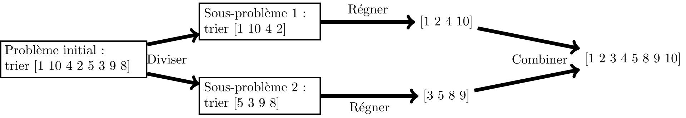

# Approche diviser pour régner
Pour résoudre certains types de problèmes complexes, il peut être utile de le diviser en sous-problèmes plus faciles à résoudre pour ensuite les combiner dans la solution finale.

Cette approche peut être utilisée pour des algorithme de tri qu'on verra plus tard dans le cours, et dans de nombreux autre algorithmes.

## Exemple : recherche dichotomique
Vous souvenez-vous de l'exercice sur le ["nombre mystère"](exercices_algo.md#nombre-mystère-jeu-de-plus-ou-moins) ?
Quelle stratégie devait-on employer pour trouver le plus rapidement le nombre en question ?

La problématique de la recherche dichotomique est de trouver la position d'une valeur recherchée dans un tableau trié.

Par exemple :
- J'ai en entrée le tableau trié [1, 6, 15, 16, 20, 25, 102, 150, 1002]
- Je veux savoir la position du nombre 16 dans ce tableau
- La réponse recherchée est donc 3 (car on commence à 0)

Les étapes sont les suivantes :
- Je compare la valeur recherchée avec la valeur à la moitié du tableau
- Si les deux valeurs sont égales, j'ai trouvé la solution, la position recherchée est la position du milieu du tableau
- Si ma valeur est plus élevée que celle au milieu du tableau, je prends la deuxième moitié du tableau et je recommence
- Si ma valeur est plus faible que celle au milieu du tableau, je prends la première moitié du tableau et je recommence

Comment écrire cet algorithme en pseudo-code ? En mode récursif ?
