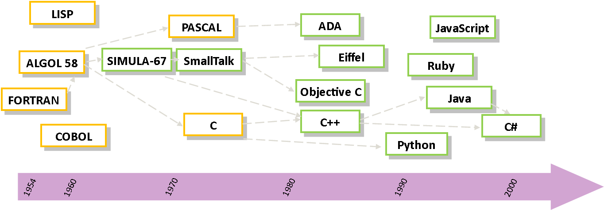

## Objectifs ##

* Avoir des notions de bases sur la conception d'un programme informatique

## Pré-requis ##

Aucun

# Architecture logicielle #

Les grandes phases de la conception d'un programme sont : l'**analyse**,
l'**algorithmie** et la **programmation**.

## Phase d'analyse ##
Avant de s'attaquer à la résolution d'un problème informatique, il est important de le formuler de façon précise dans la "langue de tous les jours". L'algorithme n'est alors finalement rien d'autre que la formulation dans un langage plus concis d'un problème clairement énoncé. Cette phase d'analyse doit être d'autant plus approfondie que le problème est complexe. Nous n'analyserons pas de la même façon la mise en place d'une chaîne de production automatisée dans une grande entreprise et le tri d'un tableau à 10 éléments.

Les personnes chargées d'analyser un problème important ont à leur disposition divers méthodes et outils (HBDS, SADT, UML, etc.) pour mener à bien leur projet.

## L'algorithmique ##
> Un **algorithme** est l'expression de l'ensemble des opérations à effectuer sur des ensembles de données pour aboutir à des ensembles de résultats.

L'*algorithmique* est la phase d'élaboration et d'écriture de l'ensemble des algorithmes nécessaire à la conception d'un programme ou d'un logiciel.

Passer par un langage algorithmique permet se concentrer sur les étapes de résolution d'un problème sans avoir à se soucier de la machine sur laquelle le programme devra fonctionner ou des spécificités du langage de programmation qui sera utilisé. Le travail de passage d'un langage d'algorithmie à n'importe quel langage de programmation n'est plus alors qu'une "simple" traduction appelée *implémentation* ou codage.

## La programmation ##
La conception de logiciels pour des ordinateurs s'oppose à un premier problème :

* l'humain utilise un langage qui lui est propre;
* l'ordinateur parle en binaire (suite de 0 et de 1).

Pour pouvoir communiquer, il est dès lors nécessaire d'utiliser un langage :

* compréhensible par l'homme;
* traduisible en binaire par la machine.

C'est le **langage de programmation**. Un *programme informatique* est une succession d'instructions exécutables par l'ordinateur. La façon d'écrire un programme est très liée au langage de programmation que l'on a choisi. D'une manière générale, le programme est un simple fichier texte (écrit avec un traitement de texte ou un éditeur plus performant appelé *IDE*), que l'on appelle *fichier source*. Le fichier source contient lui-même des lignes de programmes que l'on appelle *code source*. Ce fichier, une fois terminé, doit être compilé ou interprété pour être exécuté par la machine.

### Langages interprétés ###
L'**interprétation** consiste à parcourir un programme écrit dans un langage de programmation et à exécuter immédiatement les instructions équivalentes dans le langage machine. Le programme en langage machine n'est jamais vraiment écrit. Un programme écrit dans un langage interprété a besoin d'un programme auxiliaire (l'*interpréteur*) pour traduire au fur et à mesure les instructions du programme.

Les langages interprétés ont généralement l'avantage d'être plus *portables* (moins dépendants de l'environnement de la machine qui l'exécute).

Exemples de langages interprétés : BASIC, JavaScript, Ruby, PHP, PERL, etc.

### Langages compilés ###
La **compilation** est une opération consistant à traduire le code source écrit dans un langage de programmation en langage machine. Cette traduction est effectuée par un programme annexe appelé *compilateur* qui génère donc un nouveau fichier autonome, c'est-à-dire qui n'aura plus besoin d'un programme autre que lui pour s'exécuter; on dit d'ailleurs que ce fichier est exécutable.

Un programme écrit dans un langage compilé a comme avantage de ne plus avoir besoin, une fois compilé, de programme annexe pour s'exécuter. De plus, la traduction étant faite une fois pour toute, il est plus rapide à l'exécution. De plus, un programme compilé garantit une meilleure sécurité du code source (le code binaire est difficilement déchiffrable).

Exemple de langages compilés: C, C++, Fortran, Pascal, Go, etc.

Remarque : la compilation se décompose en 2 étapes :

* le compilateur transforme le code source en code binaire (modification du
  code source, traduction en assembleur puis assemblage en binaire);
* l'édition de liens qui permet d'intégrer dans le fichier final tous les
  éléments annexes (fonctions, librairies, fonctionnalités utilisées par le
  programme mais disponibles dans d'autres fichiers, etc.) auxquels le
  programme fait référence mais qui ne sont pas stockés dans le fichier source).

### Langages intermédiaires ###
D'autres langages appartiennent aux deux catégories à la fois. Dans ces cas là,
le programme est d'abord pré-compilé dans un langage intermédiaire appelé
généralement *bytecode*, qui est une sorte de langage machine de type
assembleur qui n'est pas directement exécutable. Ce code nécessite ensuite
d'être interprété. Par exemple, le Java fait appel à une machine virtuelle (la
JVM) pour interpréter le bytecode préalablement généré.

Les programmes écrit en langage intermédiaire gagnent en portabilité (le code
intermédiaire est le même pour toutes les machines) par rapport aux langages compilé, mais y perdent généralement en performance.

Exemple de langages intermédiaires : Python, Java, etc.

### Petit historique des langages ###
Le premier langage de programmation universel de haut niveau est le Fortran
(Formula Transistor), inventé en 1954. Il donnera ensuite naissance à l'ALGOL60
et au COBOL. Aujourd'hui, de nombreux langages de programmation, souvent
construit à partir de ces premiers langages, ont vu le jour (Java, C++, Python,
JavaScript, etc.).

# Ingénierie des système d'information #

L'ingénierie des systèmes d'information vise à transformer les besoins des
utilisateurs en spécifications d'une application formalisées pour le
développeur. Elle regroupe un ensemble de méthodes, techniques et outils aidant
à la formalisation de spécifications. Le terme de *brainware* a été introduit
en 1974 par Tosio Kitagawa mais reste assez confidentiel. L'ingénierie des
système se développera vraiment à partir des années 1990 lorsque les systèmes
informatiques à développer sont devenus plus complèxes.

Elle s'est rapidement constitué un ensemble de méthode techniques et outils
visant à assurer la qualité des applications. Les activités de l'ingénierie des
systèmes couvrent ainsi des domaines variés de la réalisation de programmes
informatiques : conception, tests, documentation, méthode de développement,
etc. Les méthodes de gestion de projet articuleront ces différents éléments
entre eux.

Nous reviendrons dans d'autres cours sur le langage UML qui est utilisé pour
modéliser des systèmes informatiques dans toutes leurs dimensions. Créé en 1995
par fusion d'outils existant, ce langage est aujourd'hui un standard de la
conception en informatique. La méthode Merise de conception et développement de
système informatiques est également très utilisé dans le monde professionnel.

