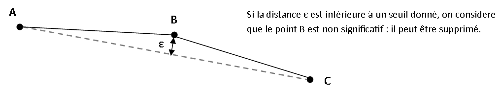
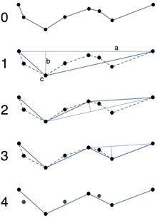

# Exercices de mise en pratique de Python

## TP — Distance entre points

Dans ce TP, nous cherchons à évaluer la **dispersion de points** tirés aléatoirement dans un carré de côté 1.
Nous nous intéresserons aux **distances minimale, maximale et moyenne** entre les points,
ainsi qu’à la **position du centre de gravité** du semis de points.

Tout au long du TP, un point sera représenté par un couple de coordonnées `(x, y)`.

### Étapes du TP

- Écrire une **fonction de tirage aléatoire** d’un point dans une emprise définie par les coordonnées `((xmin, ymin), (xmax, ymax))`

- Écrire une **fonction de tirage de `n` points aléatoires** dans cette emprise :

- **Modifier votre fonction** précédente pour que, si les coordonnées de l’emprise **ne sont pas précisées**, elles soient par défaut `((0, 0), (1, 1))`

- Compléter votre programme avec une **fonction calculant le centre de gravité** d’un ensemble de points (c’est-à-dire la **position moyenne** des points).

- Ajouter une **fonction calculant** les :
  - **distances minimale et maximale** entre deux points de l’ensemble
  - **distance moyenne** entre tous les points

- **Observer comment évoluent** ces valeurs lorsque le **nombre de points** du semis augmente.

## TP — Généralisation cartographique

### Algorithme de Douglas-Peucker

L’algorithme de Douglas-Peucker est utilisé pour **simplifier une polyligne**, en supprimant des points non significatifs de la forme globale de la géométrie.

La simplification proposée consiste à **remplacer une polyligne** de plusieurs points par une ligne à deux points si la **distance du point le plus éloigné** de la droite formée par les extrémités de la polyligne est inférieure à un **seuil**.

> Figure 1 – Principe de simplification d’une polyligne

Le principe de l’algorithme est le suivant :

- À l’étape initiale, les extrémités de la polyligne sont sélectionnées.
- Pour chacun des points entre ces deux extrémités, on calcule alors la **distance du point à la droite** liant les extrémités.

La suite du traitement dépend de la valeur de la distance maximale ainsi calculée :

1. S’il n’y a **aucun point**, l’algorithme se termine (la ligne n’est pas simplifiable) ;
2. Si la **distance maximale est inférieure à un seuil donné**, on supprime tous les points (ils sont non significatifs) ;
3. Si la **distance maximale est supérieure au seuil**, la ligne n’est pas simplifiable :
   - on **divise** la polyligne en deux parties allant :
     - de la première extrémité au point intermédiaire le plus distant
     - du point intermédiaire le plus distant à la deuxième extrémité
   - on **répète l’opération sur les deux parties**.

> Figure 2 – Principe de l’algorithme de Douglas-Peucker — source Wikipedia

---

Dans tout ce qui suit :

- un **point** est représenté par un couple de coordonnées `(x, y)`
- une **droite ou un segment** est représenté par un couple de couples de coordonnées :
  `((x_a, y_a), (x_b, y_b))`

Nous commencerons par écrire des **fonctions générales** qui seront utiles pour l’implémentation de l’algorithme à la question suivante.

---

### Étapes du TP

- Écrire une fonction **calculant la pente d’une droite**
- Écrire une fonction **calculant l’ordonnée à l’origine** d’une droite
  (elle prend en paramètre les coordonnées d’un point A de la droite ainsi que sa pente)

- Ajouter une fonction `distance(point, droite)`
  Cette fonction calcule la distance d’un point A à une droite.
  Elle devra **gérer les cas particuliers** des droites verticales ou horizontales.

Dans le cas général, pour une droite d’équation :
`y = p * x + m`
la distance d’un point `A(xA, yA)` à cette droite est donnée par la formule :

\[
d = \frac{ |p \cdot x_A - y_A + m| }{ \sqrt{1 + p^2} }
\]

- Écrire une fonction `douglas_peuker(points, e)`
  Cette fonction **simplifie une liste de points** selon la méthode de Douglas-Peucker, avec un **seuil `e`**

- Tester différents seuils sur la liste de points suivante : `(0,0), (1,0), (10,1), (11,1), (15,2), (17,1), (20,1), (27,0), (28,4), (30,6), (33,8), (34,0)`

## Gestion d'association
[TP_association.pdf](tp/TP_association.pdf)

